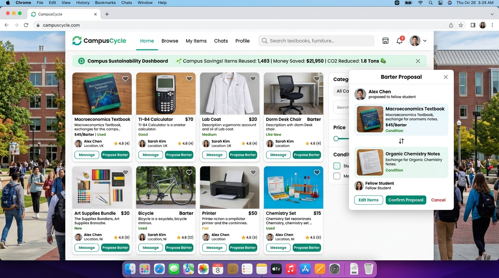
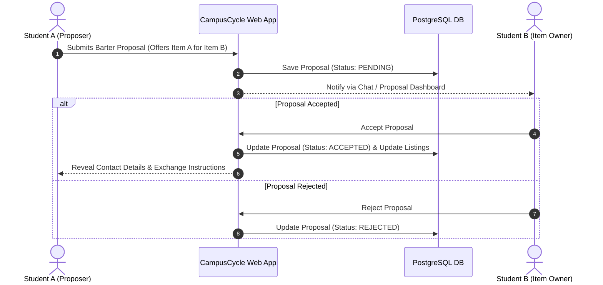

# CampusCycle – Student Marketplace & Barter Exchange Platform

      

**Tagline:** *Reuse. Exchange. Save Money. Build a Sustainable Campus.*



CampusCycle is a college-exclusive marketplace where verified students can **sell**, **buy**, **donate**, or **barter** items securely. Unlike traditional marketplaces, it encourages a circular campus economy through barter exchanges, donations, and sustainability tracking.

---

## Barter Exchange Architecture



---

## Tech Stack

| Layer | Technology |
|-------|------------|
| **Backend** | Java Servlets (Java 21), Session-based Auth, JDBC |
| **View Engine** | JSP + JSTL, CSS3, JavaScript |
| **Database** | PostgreSQL (Neon / Docker) |
| **Architecture** | MVC + Data Access Object (DAO) Pattern |
| **Testing** | JUnit 5, Mockito, Surefire, H2 (In-Memory) |
| **Containers & Deployment** | Docker Multi-Stage, Docker Compose, Tomcat 9, Vercel (`vercel.json`) |

---

## Features

- **Listing Types** – **Sell**, **Buy Request**, **Barter Exchange**, **Donation Corner**
- **Barter Engine** – Item-for-item trade proposal workflow
- **Sustainability Dashboard** – Tracks money saved, items reused, and waste prevented
- **Student Verification** – Session auth with BCrypt password hashing
- **Admin Moderation** – Report flagging and listing moderation

---

## Setup & Deployment

### Option 1: Vercel Deployment (Static Web Assets)

CampusCycle includes a custom `vercel.json` for web asset hosting on Vercel:

1. Import the repository into [Vercel Dashboard](https://vercel.com/new).
2. Set Root Directory to `CampusCycle`.
3. Deploy!

### Option 2: Docker Compose (Full Stack Tomcat + PostgreSQL)

Run application and PostgreSQL container with 1 command:

```bash
docker compose up --build -d
```
Access at `http://localhost:10000/`.

### Option 3: Local Manual Setup

#### 1. Database
Run `sql/schema.sql` on your local PostgreSQL database.

#### 2. Configuration
`DBConnection` automatically detects environment variables (`DB_URL`, `DB_USER`, `DB_PASSWORD`). Set environment variables:
```bash
export DB_URL="jdbc:postgresql://localhost:5432/campuscycle"
export DB_USER="postgres"
export DB_PASSWORD="your_password"
```

#### 3. Build & Test
```bash
mvn clean test package
```
Deploy `target/campuscycle.war` to Apache Tomcat 9/10.

---

## Testing

Run unit tests locally:

```bash
mvn test
```

Test coverage includes:
- `ListingTest`: Free item rules (`DONATE` / price = 0) & property getters/setters.
- `PasswordUtilTest`: BCrypt password hashing & verification.
- `DBConnectionTest`: Connection pool configuration & error handling.
- `TokenUtilTest`: Token generation logic.

---

## License

Educational / Portfolio project under MIT License.
